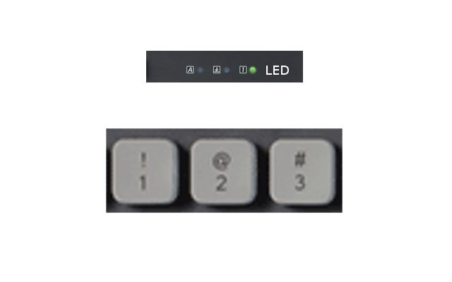

# Game of Key
The game made your keyboard, this is amazing!

# The Game

1. Set the order of your LEDs in `game.py` line `6`

2. Run `game.py` and decorate the sequence.

3. Repeat the sequence using the keys (1, 2, 3).

This is amazing!!!!!
